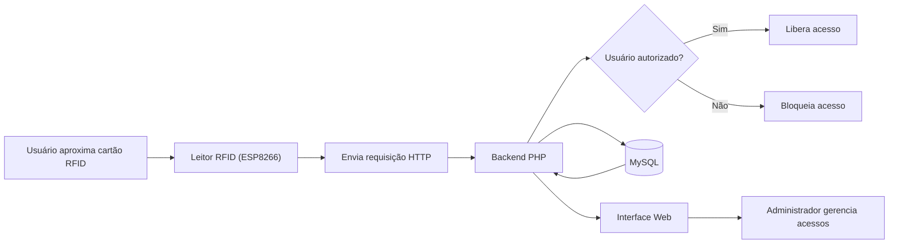

# IFGAccess 🔐

Protótipo de controle de acesso para laboratórios de informática do IFG - Campus Formosa, integrando IoT (ESP8266 + RFID) com uma aplicação web para gerenciamento e auditoria de acessos.


## 📸 Demonstração

<video src=".github/videos/cadastrar-tag.mp4" width="640" height="360" controls></video>

## 🧠 Visão Geral

O IFGAccess é uma solução que combina hardware e software para controlar o acesso a ambientes físicos utilizando autenticação por RFID.

O sistema permite:

- Identificar usuários por cartão/tag RFID
- Validar acessos em tempo real
- Registrar logs de entrada
- Gerenciar usuários via interface web

## 🏗️ Arquitetura

O sistema é dividido em três camadas principais:

- **Dispositivo IoT (ESP8266 + RFID)** → leitura das tags
- **Backend (PHP)** → validação e persistência
- **Frontend** → interface de gerenciamento

### 📊 Diagrama de Arquitetura


```mermaid
flowchart LR
    A[Usuário aproxima cartão RFID] --> B["Leitor RFID (ESP8266)"]
    B --> C[Envia requisição HTTP]
    C --> D[Backend PHP]
    D --> E{Usuário autorizado?}

    E -->|Sim| F[Libera acesso]
    E -->|Não| G[Bloqueia acesso]

    D --> H[(MySQL)]
    H --> D

    D --> I[Interface Web]
    I --> J[Administrador gerencia acessos]
```

## ⚙️ Tecnologias Utilizadas

### 🔌 Hardware

- ESP8266 (NodeMCU)
- Módulo RFID

### 💻 Software

| Tecnologia  | Versão     |
| ----------- | ---------- |
| PHP         | 7.4        |
| MySQL       | latest     |
| Bootstrap   | 5.2.3      |
| jQuery      | 3.x        |
| Docker      | 20+        |
| Arduino IDE | 1.8+ / 2.x |

## 🔌 Integração com Hardware

O ESP8266 é responsável por:

1. Ler o UID da tag RFID
2. Enviar uma requisição HTTP para o backend
3. Receber a resposta (autorizado / negado)
4. Acionar o controle físico (ex: fechadura, LED, buzzer)

## ▶️ Como Executar o Projeto

### 📋 Pré-requisitos

- Docker

### 🚀 Rodando localmente

```bash
git clone https://github.com/felurye/ifgaccess.git
cd ifgaccess
cp .env.example .env   # ajuste as senhas conforme necessário
docker-compose up --build -d
```

Acesse `http://localhost` no navegador e faça login com as credenciais definidas em `.env` (`ADMIN_USER` / `ADMIN_PASS`).

Para configurar o dispositivo físico (ESP8266), veja o [guia de instalação](https://github.com/felurye/ifgaccess/wiki/Clonar-e-rodar).

## 📡 Fluxo de Funcionamento

1. Usuário aproxima o cartão RFID
2. ESP8266 lê o UID
3. Envia requisição para o backend
4. Backend valida no banco de dados
5. Retorna resposta (permitido/negado)
6. Ação é registrada no sistema

## ✅ Funcionalidades

- Cadastro de usuários
- Registro de tags RFID
- Controle de acesso em tempo real
- Logs de entrada e saída
- Interface web administrativa

## 📖 Documentação

- [Wiki do projeto](https://github.com/felurye/ifgaccess/wiki) - funcionalidades, arquitetura e guia de uso
- [`docs/monografia.pdf`](docs/monografia.pdf) - monografia completa
- [`docs/`](docs/) - diagramas do sistema (abrir com [draw.io](https://app.diagrams.net/))

## 🤝 Contribuição

Contribuições são bem-vindas!

1. Fork o projeto
2. Crie uma branch:

```bash
git checkout -b minha-feature
```

3. Commit:

```bash
git commit -m "feat: minha nova feature"
```

4. Push:

```bash
git push origin minha-feature
```

## 📄 Licença

Este projeto está sob a licença Apache 2.0.
