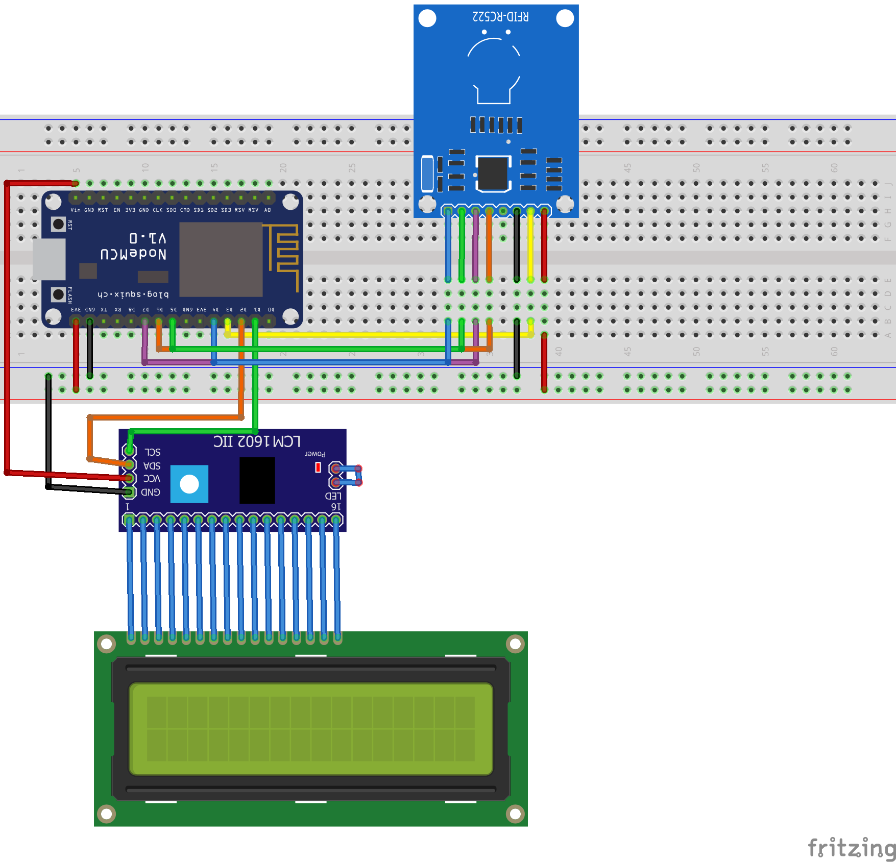

# IFGAccess
Repositório de código para a página Web do trabalho de conclusão de cursos do Instituto Federal de Goiás com o tema: IFGAccess: Sistema de Controle de Acesso Web Utilizando RFID e o Microcontrolador ESP8266 (ESP-01).

## Configurações do projeto

* PHP 7.4
* Bootstrap 5.2
* Postgres 13

## Clonando e configurando o projeto

> git clone https://github.com/felurye/ifgaccess.git

> docker-compose up --build -d

## Montagem do protótipo

